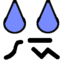

Tiny Weather Forecast Germany
=================================

Weather forecast with widgets for up to 10 days, based on open data from the Deutscher Wetterdienst (DWD).

Screenshots
--------


How to get the app
------------------

Tiny Weather Forecast Germany is available from the F-Droid main repository. You can download it here:

[](https://f-droid.org/packages/de.kaffeemitkoffein.tinyweatherforecastgermany)

**Alternative sources:**

You can get the binary builds here: <https://kaffeemitkoffein.de/nextcloud/index.php/s/qqao88LzSQ4rTeg>

Or from the developer's own fdroid repo: <https://kaffeemitkoffein.de/fdroid>

You get userdebug builds for testing here: <https://kaffeemitkoffein.de/nextcloud/index.php/s/4SXHaLxLSmFd8Ri>

Please note that the builds linked here are not signed by the fdroid key, so you basically need to uninstall the fdroid versions before installing them and vice versa.

License
-------

Copyright (c) 2020, 2021 Pawel Dube

This program is free software: you can redistribute it and/or modify it
under the terms of the GNU General Public License as published by the
Free Software Foundation, either version 3 of the License, or (at
your option) any later version.

Tiny Weather Forecast Germany is distributed in the hope that it will be useful, but
WITHOUT ANY WARRANTY; without even the implied warranty of
MERCHANTABILITY or FITNESS FOR A PARTICULAR PURPOSE. See the GNU
General Public License for more details.

You should have received a copy of the GNU General Public License
along with Tiny Weather Forecast Germany. If not, see <http://www.gnu.org/licenses/>.

Credits
-------

The Material Design icons are Copyright (c) Google Inc., licensed 
under the Apache License Version 2.0.
 
This app uses gradle and the gradle wrapper, Copyright Gradle Inc,
licensed under the Apache 2.0 license.
 
Data source: Deutscher Wetterdienst, own elements added, some data 
averaged over individual values. Weather warnings are abbreviated. Source for geo-data: Deutscher Wetterdienst.
 
This program uses the WeatherSpec class of Gadgetbridge,
Copyright (C) 2016-2020 Andreas Shimokawa, Carsten Pfeiffer,
Daniele Gobbetti, licensed under the GNU AFFRERO GENERAL PUBLIC LICENSE,
Version 3, 19 November 2007. 
 
This program uses PNPOLY - Point Inclusion in Polygon Test by W. Randolph Franklin (WRF), Copyright (c) 1970-2003, Wm. Randolph Franklin
 
This program uses the Astronomy class, Copyright (C) 2010-2012, Helmut Lehmeyer, licensed under the GNU General Public License version 3.
 
PAT maps by Ian Macky <http://ian.macky.net/pat>.

Calculation of relative humidity from temperature and dew point is done using a simplified formula example from the DWD (Deutscher Wetterdienst), see <https://www.dwd.de/DE/leistungen/met_verfahren_mosmix/faq/faq_mosmix_node.html>.

Uses the Solarized Precision colors for machines and people theme, Copyright (c) 2011 Ethan Schoonover

Contributors:

* Andreas Shimokawa (bugfixes & support for the Gadgetbridge API)
* Izzy (metadata improvements)
* Janis Bitta (new app icon)
* Jonas Lochmann (.gitignore)
* Marc Nause (code improvements, bitmap caching)
* Jean-Luc (French translation, bugfixes, javadoc improvements, translations of this README.md file)
* arwanger (README.md)
* maximilianovermeyer (fix of geo-intent-handling)
* eUgEntOptIc44 (javadoc improvements)
 
 Translations:

* German

    * eUgEntOptIc44
    * J. Lavoie
    * mondstern


* French

    * eUgEntOptIc44
    * mondstern
    * J. Lavoie


* Finnish

    * mondstern


* Italian

    * mondstern
    * eUgEntOptIc44


* English

    * Allan Nordhøy


* Dutch

    * mondstern


* Czech

    * eUgEntOptIc44
    * mondstern


* Norwegian Bokmål

    * mondstern
    * Allan Nordhøy


* Polish

    * mondstern

* Spanish

    * eUgEntOptIc44

 Get involved in *Tiny Weather Forecast Germany* and [help to translate it into more languages or complete existing translations](https://weblate.bubu1.eu/engage/tiny-weather-forecast-germany/).


Privacy
-------
 
For the privacy statement, see [here](https://codeberg.org/Starfish/TinyWeatherForecastGermany/wiki/Home).

Concept
-------
 
The idea is to create a simple, floss and light-weight weather forecast app with a focus on home screen widgets that uses open data from the Deutscher Wetterdienst (DWD) and that does not track the users.
 
Permissions
-----------

The app uses the following permissions:
 
* Internet: needed to get forecast data from the DWD.
* Access network state: query network state before getting data.
* foreground service: a foreground service is used to reliably get the forecast data. The service does not run all the time but only when a weather forecast update from the DWD needs to be done, and it runs until it is finished.
* Receive boot completed: the app needs to know about a reboot to restart periodic checks if an update is due, to update widgets and to send data to Gadgetbridge when enabled.
* Access fine location: used to determine the closest weather sensors to your position. This permission needs not to be granted if this feature is not used or if the search is performed based on manually entered geo-coordinates.

FAQ
---

### For locations in a different time zone the day/night icons seem incorrect.
 
The app always displays the date & time of your device (and locale). Example: you are in Berlin and have selected the weater for Cuba. The app shows you the weather in Cuba at the corresponding Berlin time and uses the day/night-icons corresponding to the Berlin time. Once you have travelled to Cuba and your device switched to the local time in Cuba, the app will display the weather in Cuba at the Cuba time.   
 
### How to read the widget?
 
The widget icon, the weather description and the current temperature refer to the weather forecast that can be expected until the next full hour. The low and high temperatures refer to the values that can be expected to occur from now to midnight.

When showing more days (bold widget, large widget), the min and max values and the weather symbol refer to the whole day.

To display weather warnings in widgets, you need to enable this feature in the settings. When enabled, the *most severe* weather warning issued for your location is displayed in the widget. When there are multiple warnings issued, this is indicated by three dots ("...") and a plus ("+"). You have to go to the app to see them all.  
 
### What do the symbols in the main app mean?
 
Symbols used:
 precipitation
 clouds
 thunderstorm
 hail
 freezing rain
  fog
 drizzle
 wind direction
 temperature 5 cm above ground level
 relative humidity

### What do the icons show do?

You may get a hint about their functionality if you just _long-press_ them.
 
### My widgets don't get updated (unless I open the app).

The widgets get updated every 15-30 minutes. If this does not happen at all or only happens when you open the app, then you likely have a device that prefers battery life over proper functionality. Likely, some so-called *battery saving feature* kills the components of the app and breaks the updates. See [this page](https://dontkillmyapp.com/) to check if you own such a device and what you can do. 
 
### How often does the app update the weather forecast?
 
The Deutscher Wetterdienst updates the forecast data that is used every 6 hours. Therefore, it does not make sense to pull weather data more frequently than this from the DWD API. However, a manual data update triggered by the user's selection in the main app always forces an update of forecast data. The forecast data covers the next ten days. So it is pretty feasible to present a weather forecast for some time without polling new data.
 
### How often does the GadgetBridge app gets updated (when this feature is enabled)?
 
When GadgetBridge support is **enabled**, the app will, in the best case, update GadgetBridge every 30 minutes using forecast data that is already in place, meaning that the DWD API will not be called for this. However, on devices with API 23 or higher, such updates might not occur that regularly when the device goes in *doze mode*, but should be launched in the so-called “maintenance window”, and it is difficult to say what this really means in manners of time. This will likely mean very different things depending on the device and/or ROM.
  
If you encounter problems with GadgetBridge not updating, placing a widget on the home screen may help, since the widget will try to also update GadgetBridge every time the widget itself gets updated by the system.
  
### Why is percipitation displayed in kg/m² instead of mm?
  
This unit is more precise regarding solid precipitation (e.g. snow). Assuming rain, after some converting of units you will notice that the value is the same like "mm".
  
### Why does the app sometimes not display sunrise und sunset?
  
Sunrise and sunset cannot be reliably calculated with the formulas used for latitudes < -65° and > 65°. When this is the case, this feature is disabled.

### Why does the app show a particular weather icon (and not an other)?

Icons refer to *significant weather conditions*. The idea is to show you the most important (significant) weather condition that you can expect to occur within the given time period. For example, thunderstorms have a higher priority than rain and rain/fog have a higher priority than clouds. If such a significant weather condition is likely to occur, it will be preferred over others.

Usually, the weather conditions are _calculated by the DWD_. If a weather condition is not available in the forecast data, the app tries to calculate it from other items. If you are interested how this app calculates icons in this case, see [here](https://codeberg.org/Starfish/TinyWeatherForecastGermany/src/branch/master/app/src/main/java/de/kaffeemitkoffein/tinyweatherforecastgermany/WeatherCodeContract.java) in the source code.

Thresholds for significant weather conditions are subjective and perhaps debatable, but weather conditions calculated by the DWD have priority and always remain unmodified, if available. If you are interested in the priorities, see [this DWD document](https://www.dwd.de/DE/leistungen/opendata/help/schluessel_datenformate/kml/mosmix_element_weather_xls.xlsx?__blob=publicationFile&v=6).

### Why does the app give a different value for some parameter (e.g. temperature) than the official station reading?

Tiny Weather Forecast Germany gives _forecasts_, not the current reading at some weather station. If the displayed value in Tiny Weather Forecast Germany differs from an official reading at some spot, the forecast was just off.

### Where do the names come from that are offered in searches?

Tiny Weather Forecast Germany uses _WarncellIDs_ for the regions offered. These are closely related to the [Amtlicher Gemeindeschlüssel](https://www.destatis.de/DE/Themen/Laender-Regionen/Regionales/Gemeindeverzeichnis/_inhalt.html) (AGS) provided by destatis. Basically, the WarncellIDs are an extension of the AGS. WarncellIDs also feature human-readable names (e.g. "Landkreis Göttingen"). These names can be used while looking for a weather station. They _do not_ refer to the names of weather stations. Once you select a name  the app will give you a list of close by stations including their distance to choose from. This distance is derived from the center of the area polygon(s) associated with a given region. It may happen, that a WarncellID has more than one search key associated. E.g. searching for `Insel Helgoland` or `Gemeinde Helgoland` will show a list starting with `Helgoland` at an approximate distance of 0.4 km. Hence the weather station is actually just called `Helgoland`.

*Note* more than one station will be shown if your search matches a search key. These stations are sorted by increasing distance from the initially searched entity. E.g. searching for `Insel Helgoland` in the above example will also show `Elbmuendung` (a sea area next to Cuxhaven) which is 23.4 km away, `UFS Deutsche Bucht` (an automatized weather station aboard a light vessel in the middle of the German Bight) already 29.3 km away, or `Wangerooge` (one of the East Frisian islands) at a distance of 29.4 km. (And of course many others even further away.) If `Helgoland` is searched however, it matches the station right away, and the app jumps to it immediately without a further selection.

As a rule of thumb, when a name is written in capital letters (e.g. "BERLIN-ALEX."), it is the weather station. All other names help you find the proper weather station.

### Is there a map available to choose a spot if I don't know the proper names in the vicinity?

You can use any application on your device that allows to share coordinates via `geo:`-intents to Tiny Weather Forecast Germany. Most mapping and location applications will allow this.

This also works from a web browser, provided the page in question offers a `geo:` link. [geohack](https://geohack.toolforge.org) is a common service that provides such links as `Geo URI` (e.g. for [Helgoland](https://geohack.toolforge.org/geohack.php?pagename=Helgoland&language=de&params=54.1825_N_7.8852777777778_E_region:DE-SH_type:city(1307))). You may want to note that also Wikipedia links to this service once you click on the geographic coordinates in their web pages. (However, they do not provide a direct `geo:` link, yet.)

### Why does the delete icon next to the location not remove the selected location?

The delete icon works the other way around: it does not remove the currently displayed region but _all other_ regions that were selected at some point in the past. The idea of Tiny Weather Forecast Germany is centred around the idea of your usual location and not so much on a list of bookmarks.

### How do I delete a location?

Select your new region and hit the clean button next to the regions title. Mind that this will clean _all other_ regions, except the one currently displayed.

### Why does the app not update a location? It is in my bookmarks.

Tiny Weather Forecast Germany tries to be very conservative with your download volume. For this reason it only updates the currently displayed region. All other regions in the regions drop down are merely places once visited and do not get any updates.

*Note* the currently selected region is also the region displayed in any widget added to the home screen.

### How do I set the region to be displayed at the home screen widget?

Just select it as current region in the app. The region displayed in the app and in the widget stay in sync all the time. Any region change in the app is reflected in the widget(s) automatically.

### How can I fetch weather for a different location if I go on travel?

If you want to update a different location e.g. before travelling, select it first and update the data. (If `Always update` is not set you may do this manually.) You can then revert to your standard location. Tiny Weather Forecast Germany will remove data only once it got invalid over time, but keep all fetched data in it's internal cache.

### Why do some coloured polygons show up next to the coasts sometimes?

Those stem from coastal or sea area warnings issued by DWD in their shipping forecasts. The warning areas correspond to the coastal and sea areas in those reports. The definitions of the sea areas can be found in the document "Sturmwarnungen und Seewetterberichte für die Sport- und Küstenschifffahrt" published regularly by DWD or "Wetter- und Warnfunk" updated yearly by the Bundesamt für Seeschifffahrt und Hydrographie (BSH).

*Note* there is a coastal area that stretches along the Elbe from Cuxhaven to Hamburg.

### Which weather model is the app using?

The app uses the *MOSMIX* model provided by Deutscher Wetterdienst (DWD). "The MOSMIX System of Deutscher Wetterdienst optimizes and interprets the computations of the numerical models ICON and IFS (ECMWF) and combines them to statistically optimal weather forecasts." (DWD). This model provides data for almost all common meteorological parameters and uses statistical methods to derive parameters not available in the numerical models. More details can be found at [the MOSMIX page at Deutscher Wetterdienst (DWD)](https://www.dwd.de/EN/research/weatherforecasting/met_applications/nwp_applications/mosmix_application_node.html)

### Can I access textual/specialized weather reports?

Tiny Weather Forecast Germany offers an extensive list of textual weather reports as provided by DWD. Those include short and medium term synoptic reports as well as specialized reports for the coastal regions of Germany, the sea weather bulletin for the North- and Baltic sea and the Mediterranean. Strong wind, gale and storm warnings are available for the German Bight, western and southern Baltic. *Note* Keep in mind that Tiny Weather Forecast Germany uses the data from DWD, so some textual reports are available in German only and the textual reports cover mainly Germany.

*Note* the textual sea and coastal weather reports coincide with those published by DWD via [RTTY radio broadcasts](https://www.dwd.de/EN/specialusers/shipping/broadcast_en/_node.html) but are drawn from the OpenData-server.

### What does wind direction "Beaufort" do? The wind speed still displays in another unit.

Setting the wind direction to Beaufort will display the wind as in a weather map with proper feathering according to the Beaufort scale, but it only affects the symbol used to display the wind direction. To set the unit used for wind speed to Beaufort use the appropriate setting in "Wind speed".

*Hint* setting the wind speed e.g. to knots and the display to `Beaufort` might be a good way to learn the Beaufort scale.

### What does the small arc next to the wind display refer to?

It shows the direction of the wind change during the next `Wind forecast period`. E.g. if the wind comes from the south and there is a quarter of an arc to the right next to it and the `forecast period` is set to 6h the wind will veer from S to E in the next 6 hours.

### When do I get a notification about a weather warning?

First of all, you need to enable this feature in the settings. Second, you need to specify how often the app will update the warnings (see below). Then, you will get notifications about warnings issued for the selected location. **The app will not check for warnings when the device is in doze mode**. So do not expect to get woken up in the middle of the night when a weather warning get issued.

### Which warnings get notified?

You will get notified about all warnings issued for the selected location. The app does not filter for similiar types of warnings, so you may get separate warnings e.g. regarding *storm* and *gusts*.

You will be notified about warnings with a future onset once they get issued and about warnings that are already ongoing. Warnings may sometimes get issued on a short-term basis and are sometimes followed up by a similiar event with a different severity.

When your device has been turned off and/or in *doze mode*, old warnings that already passed won't get notified. 

### How quickly do I get a warning?

In the settings, you can set up the interval how often warnings are checked. The default is every 30 minutes. Please note that the interval specified may have quite an implact on battery drain and data volume use. When weather conditions are heavy, warning data may be about 300 Kb or even more in size. 

Please note, that every notification has a time specified:
- when it says "*in 3h*", the warning has an onset in *approximately* 3 hours. Please tap the warning and go  to the app to get the detailed onset time.
- when it says "6h", the warning is effectice *since* approximately 6h.

To get an immediate and current warning status, go to the app and hit "update".

### Why does the app not process all the single warnings?

Because listening to new warnings continuously with a very high frequency would drain your battery very fast. When polling e.g. every 30 minutes, there is even no significant benefit regarding the data size when you compare all the single warnings issued with the whole data set that gets downloaded.

### What is the logic about the notifications? 

Once a new warning gets issued **or** when an existing warning gets updated, you will get notified. A warning you have been already notified about will be repeated after 12 hours, provided it is still valid. 

### How do I provide a crash log?

Please keep in mind: device logs may include and/or compromise sensitive information, consider reviewing the logs before sending.   

If you pose yourself this question one can assume that you don't shy away from some more technical stuff. It is not enormously complex, though, so just read on, even though it requires you to install some developer tools. The idea is to provide a really detailed log of what Tiny Weather Forecast Germany actually did till the point where it died or did something unpredictable. All this is logged by your device, however, usually you can not see those logs.

The key to access those extensive logs is to hook up your device to your PC via USB and use a tool called Android Debug Bridge (`adb`) to access the system log.

The following steps need to be done _only once_:

1. Install `adb`. Most Linux distributions package it. If you use another operating system or it is not packaged in your distribution you can download it from https://developer.android.com/studio/releases/platform-tools for various platforms as ZIP-files to unpack and use the usual means to install software there. You will also find a very extensive discussion of `adb` itself [here](https://developer.android.com/studio/command-line/adb). For the purposes at hand it is enough to just get it installed, though.
2. Enable the developer options on your device. Extensive instructions can also be found here: https://developer.android.com/studio/debug/dev-options. The short form:
    1. Find the build number of your phone.
        - Open `Settings` (Searching for `Build number` might guide you directly to it)
        - Go to `System`
        - Go to `About phone`
    2. Tap the `Build number` several times.
    3. A dialogue informs you how many taps you are a way from being a developer
    4. Keep tapping on `Build number` until you see _You Are Now a Developer_
3. Enable USB debugging in the developer options of your device:
    1. Open `Settings`
    2. Search for `USB debugging`
    3. Make sure it is switched on


After this initial setup, you are ready to access the system log.

1. Connect your device to the PC via USB
2. Open a terminal/command line/shell and start `adb logcat`. This will display the devices log on the shell. Beware, this is a _lot of_ scroll. You may want to redirect it to a file or use some shell extension that allows searches in the text output (like `screen` or `tmux`). To redirect `adb logcat > android.log` should do the trick. It will create a file `android.log` which is a plain text file that can be viewed in any text editor.
3. Watch out for stuff related to the app. A typical log start similar to this:
```
08-20 13:16:33.114  1529  3193 I ActivityManager: START u0 {act=android.intent.action.VIEW flg=0x1000c000 cmp=de.kaffeemitkoffein.tinyweatherforecastgermany/.TextForecastListActivity bnds=[290,534][430,692]} from uid 10477
```
   `de.kaffeemitkoffein.tinyweatherforecastgermany` is the apps key and signifies that the interesting parts will follow. You'll get the crash information further down. It starts like this:
```
08-20 13:16:33.244 11798 11798 D AndroidRuntime: Shutting down VM
08-20 13:16:33.245 11798 11798 E AndroidRuntime: FATAL EXCEPTION: main
08-20 13:16:33.245 11798 11798 E AndroidRuntime: Process: de.kaffeemitkoffein.tinyweatherforecastgermany, PID: 11798
```
    Read: fatal exception in `de.kaffeemitkoffein.tinyweatherforecastgermany` (PID will show another number.) So, Tiny Weather Forecast Germany died unexpectedly.
6. Copy all the blurb from the start mentioned in 3. above till you reach a line that holds
```
ActivityManager:   Force finishing activity de.kaffeemitkoffein.tinyweatherforecastgermany/.TextForecastListActivity
```
7. Log in to `https://codeberg.org` 
8. Navigate to the issue tracker `https://codeberg.org/Starfish/TinyWeatherForecastGermany/issues`
10. Create an issue describing what you did and add the log just created (copy&paste will do).


Contributing
------------

Please leave comments, bug reports, issues and feature requests at
the app repository at codeberg.org:
 
<https://codeberg.org/Starfish/TinyWeatherForecastGermany>
 
Alternatively, for suggestions and bug reports, you can contact me by email: weather (at) kaffeemitkoffein.de 

Get involved in *Tiny Weather Forecast Germany* and [help to translate it into more languages or complete existing translations](https://weblate.bubu1.eu/engage/tiny-weather-forecast-germany/).