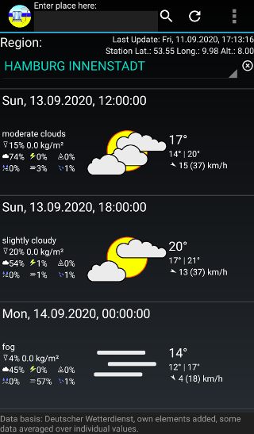
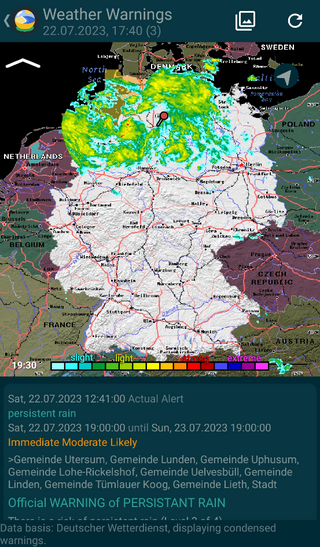
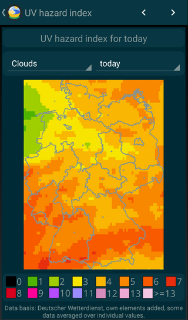

Tiny Weather Forecast Germany
=================================

Weather forecast with widgets for up to 10 days, based on open data from the Deutscher Wetterdienst (DWD).

Screenshots
--------

How to get the app
------------------

Builds are available through the f-droid repo of @izzydroid: <https://android.izzysoft.de/repo.php>.

You get builds for testing here: <https://kaffeemitkoffein.de/nextcloud/index.php/s/NxjPfLNfAfYB9PN>

License
-------

 Copyright (c) 2020 Pawel Dube

 This program is free software: you can redistribute it and/or modify it
 under the terms of the GNU General Public License as published by the
 Free Software Foundation, either version 3 of the License, or (at
 your option) any later version.

 Tiny 24h Weather Forecast Germany is distributed in the hope that it will be useful, but
 WITHOUT ANY WARRANTY; without even the implied warranty of
 MERCHANTABILITY or FITNESS FOR A PARTICULAR PURPOSE. See the GNU
 General Public License for more details.

 You should have received a copy of the GNU General Public License
 along with TinyWeatherForecastGermany. If not, see <http://www.gnu.org/licenses/>.

Credits
-------

 The Material Design icons are Copyright (c) by Google Inc., licensed 
 under the Apache License Version 2.0.
 
 This app uses gradle and the gradle wrapper, Copyright by Gradle Inc,
 licensed under the Apache 2.0 license.
 
 Data source: Deutscher Wetterdienst, own elements added, some data 
 averaged over individual values.
 
 This program uses the WeatherSpec class of Gadgetbridge,
 Copyright (C) 2016-2020 Andreas Shimokawa, Carsten Pfeiffer,
 Daniele Gobbetti, licensed under the GNU AFFRERO GENERAL PUBLIC LICENSE,
 Version 3, 19 November 2007. 
 
 This program uses PNPOLY - Point Inclusion in Polygon Test by W. Randolph Franklin (WRF), Copyright (c) 1970-2003, Wm. Randolph Franklin
 
 PAT maps by Ian Macky <http://ian.macky.net/pat>.
 
 Contributors:
 - Andreas Shimokawa (bugfixes & support for the Gadgetbridge API)
 
 Privacy
 -------
 
 For the privacy statement, see [here](https://codeberg.org/Starfish/TinyWeatherForecastGermany/wiki/Home).

 Concept
 -------
 
 The idea is to create a simple, floss and light-weight weather forecast app with a focus on home screen widgets that uses open data from the Deutscher Wetterdienst (DWD) and that does not track the users.
 
 Tiny Weather Forecast Germany does not use any third-party libraries.
  
 FAQ
 ---
 *For locations in a different time zone the day/night icons seem incorrect.*
 
 The app always displays the date & time of your device (and locale). Example: you are in Berlin and have selected the weater for Cuba. The app shows you the weather in Cuba at the corresponding Berlin time and uses the day/night-icons corresponding to the Berlin time. Once you have travelled to Cuba and your device switched to the local time in Cuba, the app will display the weather in Cuba at the Cuba time.   
 
 *How to read the widget?*
 
 The widget icon, the weather description and the current temperature refer to the weather forecast that can be expected until the next full hour. The low and high temperatures refer to the values that can be expected to occur from now to midnight.
 
 *What do the symbols in the main app mean?*
 
 Symbols used:
 
  precipitation
 
  clouds
 
  thunderstorm
 
  hail
 
  freezing rain
 
  fog
 
  drizzle
 
  wind direction
 
 *Does the app display the actual, current weather?*
   
 No. This app is about weather forecasts. You see the weather you can expect to occur until the displayed time. For the widgets, see above.  
        
 *How often does the app update the weather forecast?*
 
 The Deutscher Wetterdienst updates the forecast data that is used every 6 hours. Therefore, it does not make sense to pull weather data more frequently than this from the DWD API. However, a manual data update triggered by the user's selection in the main app always forces an update of forecast data. The forecast data covers the next ten days. So it is pretty feasible to present a weather forecast for some time without polling new data.
 
 *How often does the GadgetBridge app gets updated (when this feature is enabled)?*
 
  When GadgetBridge support is **enabled**, the app will, in the best case, update GadgetBridge every 30 minutes using forecast data that is already in place, meaning that the DWD API will not be called for this. However, on devices with API 23 or higher, such updates might not occur that regularly when the device goes in *doze mode*, but should be launched in the so-called “maintenance window”, and it is difficult to say what this really means in manners of time. This will likely mean very different things depending on the device and/or ROM.
  
  If you encounter problems with GadgetBridge not updating, placing the widget on the home screen may help, since the widget will try to also update GadgetBridge every time the widget itself gets updated by the system.
  
  *Why is percipitation displayed in kg/m² instead of cm?*
  
  Because the DWD provides this data this way. This cannot be changed. Please consider that this unit is more precise regarding the amount of hail and snow.
  
 Contributing
 ------------

 Please leave comments, bug reports, issues and feature requests at
 the app repository at codeberg.org:
 
 https://codeberg.org/Starfish/TinyWeatherForecastGermany
 
 Alternatively, for suggestions and bug reports, you can contact me
 by email: weather (at) kaffeemitkoffein.de 
